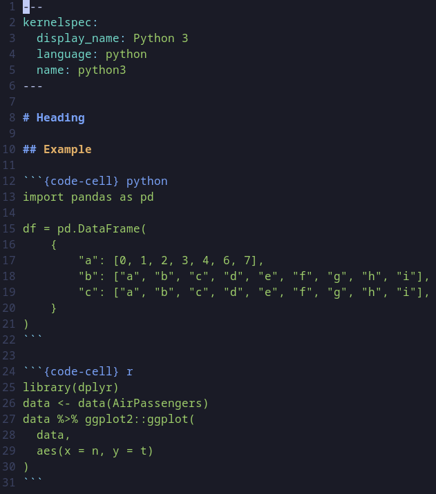
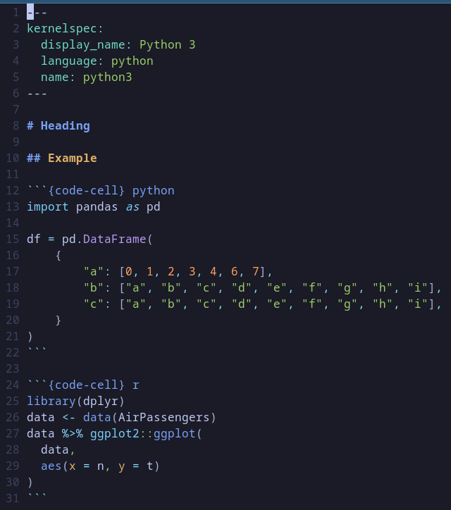

# mystnb.nvim

Detect language attached to [myst-notebook](https://jupyterbook.org/en/stable/file-types/myst-notebooks.html)'s code cells in neovim.

## Example

Without mystnb.nvim



With mystnb.nvim



## Installation

With packer:

```lua
use({
    "sondalex/mystnb.nvim",
    config = function()
    require("mystnb").setup()
    end
})
```

## Settings

Default settings

```lua
{
lookup = { ipython3 = "python", ipython = "python" }
}
```

Lookup associates a specific keyword to a treesitter language.

Example:

This cell is associated to python


    ```{code-cell} python 
    import math
    ```


mystnb also detects language if you provide a file extension.
Example: 


    ```{code-cell} py
    import math
    ```


    ```{code-cell} jl
    using DataFrame
    DataFrame(
        "product identifier" => [15, 20, 25],
        "product name" => ["Apple", "Pear", "Peach"]
    )
    ```

## Testing (Unix based only)

```bash
./tests/run
```


